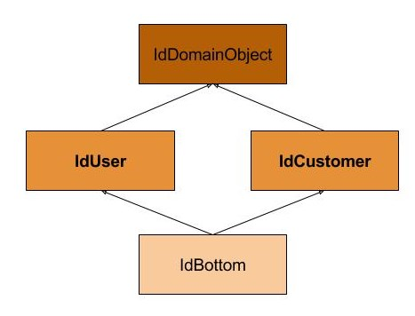

# Subtyping
This repo contains a small test how to use the checker-framework [subtyping checker](https://checkerframework.org/).

It contains 2 gradle projects:

* the **main** project in the root directory
* the **subtypes** project in the [mSubtypes](mSubtypes) directory

## Subtypes project
The subtypes project contains our custom type definition annotations:

* IdDomainObject is the top type
* IdUser, IdCustomer are the custom types, we want to use in the main project
* IdBottom is the bottom type

## Main project
When you build the main project it will automatically build the subtypes project: 
see [build.gradle](build.gradle) 

